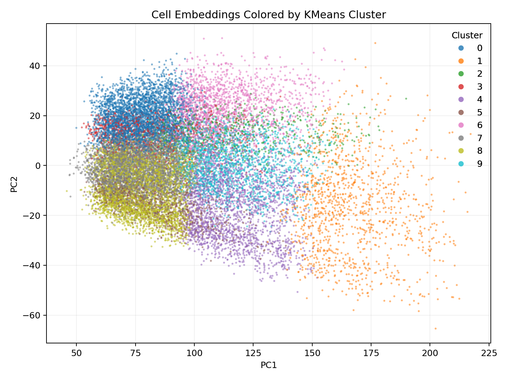
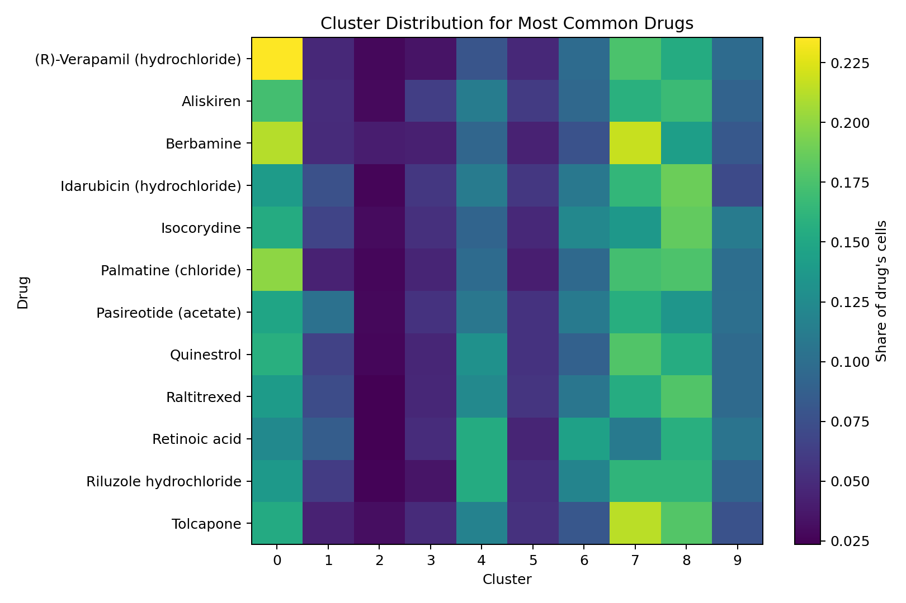

# Tahoe-100M Single-Cell Transcriptomics Pipeline

This project builds clustered transcriptomic embeddings from the public
Tahoe-100M single-cell perturbation dataset. It is designed as a reproducible
bioinformatics/data science pipeline that can be explained clearly in an
interview: data ingestion, sparse matrix construction, normalization,
dimensionality reduction, clustering, and result visualization.

## Project Highlights

- Streams single-cell data from Hugging Face instead of requiring a full local dataset download.
- Builds a sparse cell-by-gene expression matrix for memory-efficient processing.
- Applies CPM-style library-size normalization followed by `log1p`.
- Uses `TruncatedSVD` for sparse dimensionality reduction.
- Clusters cells with `KMeans` in embedding space.
- Generates visual artifacts for interpretation: cluster scatter plot, explained variance, cluster counts, and drug-cluster heatmap.
- Exports cluster quality metrics and structured tables for analysis beyond visual inspection.
- Includes a supervised benchmark that tests whether embeddings predict mechanism-of-action labels.

## Current Demo Run

The included outputs summarize a 20,000-cell run.

| Metric | Value |
| --- | ---: |
| Cells analyzed | 20,000 |
| Embedding dimensions | 50 |
| Clusters discovered | 10 |
| Drugs represented | 44 |
| Cell lines represented | 50 |
| Mechanism-of-action labels represented | 8 |
| Cumulative explained variance | 0.095 |

The report also exports clustering quality metrics:

- Silhouette score
- Davies-Bouldin score
- Calinski-Harabasz score
- Cluster balance ratio

The supervised benchmark evaluates whether the 50-dimensional embeddings retain mechanism-of-action signal:

| Metric | Value |
| --- | ---: |
| Balanced accuracy | 0.239 |
| Baseline balanced accuracy | 0.125 |
| Macro F1 | 0.102 |
| Classes | 8 |

## Example Figures

### Clustered Cell Embeddings



### Drug-by-Cluster Distribution



## Repository Structure

```text
.
+-- README.md
+-- requirements.txt
+-- pyproject.toml
+-- configs/
|   +-- default_run.json
+-- .github/
|   +-- workflows/
|       +-- ci.yml
+-- embeddings.csv
+-- pca_variance.csv
+-- src/
|   +-- __init__.py
|   +-- evaluate_embeddings.py
|   +-- tahoe_pipeline.py
|   +-- make_report.py
+-- tests/
|   +-- test_tahoe_pipeline.py
+-- outputs/
|   +-- analysis_summary.md
|   +-- figures/
|       +-- cluster_counts.png
|       +-- drug_cluster_heatmap.png
|       +-- explained_variance.png
|       +-- pc1_pc2_clusters.png
|   +-- tables/
|       +-- cluster_counts.csv
|       +-- cluster_quality_metrics.csv
|       +-- drug_cluster_counts.csv
|       +-- drug_cluster_proportions.csv
|       +-- metadata_summary.csv
|   +-- evaluation/
|       +-- moa_classification_report.csv
|       +-- moa_confusion_matrix.png
|       +-- moa_prediction_metrics.csv
+-- docs/
    +-- interview_notes.md
    +-- project_status.md
```

## Quickstart

Create an environment and install dependencies:

```bash
python -m venv .venv
.venv\Scripts\activate
pip install -r requirements.txt
```

Run the full pipeline:

```bash
python src/tahoe_pipeline.py --samples 20000 --pca-dim 50 --clusters 10 --output-dir outputs
```

Regenerate the figures and summary report from the included CSV outputs:

```bash
python src/make_report.py --embeddings embeddings.csv --variance pca_variance.csv --output-dir outputs
```

Run the lightweight unit tests:

```bash
python -m unittest discover -s tests
```

Evaluate whether embeddings retain mechanism-of-action signal:

```bash
python src/evaluate_embeddings.py --embeddings embeddings.csv --label-col moa-fine --output-dir outputs/evaluation
```

The original script filename still works as a compatibility wrapper:

```bash
python ucla_tahoe100m_pipeline_v2.py --samples 20000 --output-dir outputs
```

## Methodology

1. Stream tokenized single-cell expression records from `tahoebio/Tahoe-100M`.
2. Load gene metadata and map token IDs to Ensembl gene IDs.
3. Build a sparse cell-by-gene matrix using `scipy.sparse.csr_matrix`.
4. Normalize each cell by total expression, scale to counts per million, and apply `log1p`.
5. Reduce dimensionality with `sklearn.decomposition.TruncatedSVD`.
6. Cluster low-dimensional embeddings using `sklearn.cluster.KMeans`.
7. Export embeddings, variance diagnostics, plots, and an analysis summary.
8. Export cluster validation metrics and tabular summaries for deeper inspection.
9. Train a lightweight supervised benchmark to test whether embeddings preserve mechanism-of-action signal.

## Results to Discuss

The current run shows visible structure in the first two embedding dimensions and separates the 20,000 sampled cells into 10 clusters. The drug-cluster heatmap provides a first-pass view of how common compounds distribute across transcriptional response clusters. The supervised benchmark adds a second check by asking whether the learned embeddings contain enough signal to predict mechanism-of-action labels better than a simple majority-class baseline.

In the included 20,000-cell run, the mechanism-of-action labels are heavily imbalanced. The supervised benchmark is therefore best judged with balanced accuracy and macro F1, not raw accuracy.

These clusters should be interpreted as candidate structure, not final biological conclusions. A stronger next step would validate clusters against known mechanism-of-action labels, apply batch-effect correction, and test whether embeddings improve downstream prediction tasks.

See [docs/interview_notes.md](docs/interview_notes.md) for a short project pitch and likely interview questions. See [docs/project_status.md](docs/project_status.md) for maturity, limitations, and next steps.

## Resume Bullet

Built a reproducible Python pipeline for Tahoe-100M single-cell perturbation data, streaming 20,000 cells, constructing sparse gene-expression matrices, applying log-normalized CPM preprocessing, reducing dimensionality with TruncatedSVD, clustering transcriptomic profiles with KMeans, and generating diagnostic visualizations for drug-response analysis.
